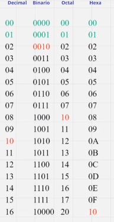
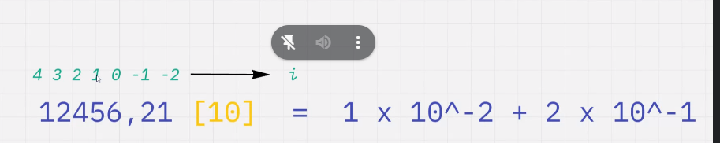

# sistema de numeracion

## contexto historico

a lo largo de la historia se crearon multiples sistemas de numeracion, son sistemas donde mediante ideogramas y la combinacion de los mismos se representan valores numericos, el profesor en este momento enuncia multiples sistemas de numeracion utilizados a lo largo de la historia (babilonico, egipcio, romano, maya, sistema decimal o de base 10)

los sistemas que nos importan son binario y hexadecimal

se puede observar que el 10 siempre se combinan cuando se alcanza el limite de caracteres 

## base

la base escrita en su propia base se escribe 10, la base viene a ser la cantidad maxima de simbolos de un sistema de numeracion

las bases se escriben asi:

´´´

327 --> numero
    [8] --> base

´´´

## mecanismos para cambiar la base

### teorema fundamental de la numeracion

´´´
            mas infinito
C = X * B Σ  Xi * B ^ I 
            menos infinito
´´´

ejemplo:

seria digito por base elevado a la posicion del numero post coma y pre coma todo eso sumado segun indice  *importante:* la potencia a la cual se eleva debe ser escrita en la base a la cual se convierte

### mecanismos de pasaje de base

pasas de decimal a cualquier base es dividir el numero por la base buscada y quedarse con los restos 
en los numero con coma es parecido solo que multiplicando, te tenes que ir quedando con los numeros enteros que te quedan