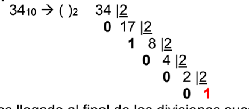
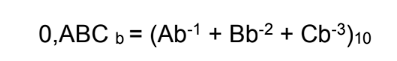
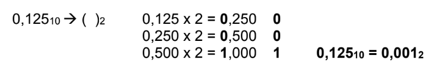

# sistemas de numeracion

los sistemas de numeracion son sistemas de simobolos que representas distintos valores de indole contable, su objetivo es poder almacenar datos o valores en una computadora y que esta mediante dichos sistemas pueda identificarlos y distinguirlos

## sistemas de numeracion no posicional

son sistemas de numeracion en los cuales la posicion del simbolo no tiene relacion con el valor del mismo, un ejemplo son los numeros romanos donde CCXXI la c vale 100 y la x vale 10 pero independiente a su posicion en el numero va a seguir valiendo 100 y 10 respectivamente

## sistemas de numeracion posicional

son aquellos donde la pocision del simbolo importa a la hora de determinar su valor, por ejemplo en el 221 el primer 2 vale 200 y el segundo 2 vale 20, el sistema mas conocido es el decimal

un sistema de numeracion posicional de base b es aquel sistema donde siempre la base es igual a la cantidad de simbolos del mismo, ejm: en el decimal tenemos base 10 ya que podemos usar 10 simbolos : [1,2,3,4,5,6,7,8,9,0]

## teorema fundamental de la numeracion:

```

sea abc def simbolos y sea b la base
(...ABC, DEF...) = Ab^2 + Bb^1 + Cb^0 + Db^-1 + Eb^-2 + Fb^-3

```

## cambio de base

supongamos que se quiere convertir un numero de una base a otra, existesn 3 casos elementales

### numeros enteros

```
A. Nb -> ()10

ABCDb = (Ab^3 + Bb^2 + Cb^1 + Db^0)10

B N10 -> ()b


```


```
C. Nb -> ()p

se combinan los 2 anteriores

Nb -> ()10
N10 -> ()b

```

### numeros fraccionarios

```
A. 0,Nb->10
```


```
B. 0,N10 -> ()b
```

Se resuelvo mediante multiplicaciones sucesivas tomando de cada resultado la parte entera, se termina cuando la parte fraccionaria es igual a 0 o hasta que alcanzamos la precision buscada



```
C. 0,Nb -> ()p
```
se cambia de b a 10 y de 10 a p