# Abacus-Superabacus

## Arquitectura de Von Neumann

Hasta los años 40, las computadoras constaban de un panel frontal y de switches (conmutadores), los cuales, mediante conexión y desconexión, se encargaban de hacer que la computadora realizara las operaciones deseadas. No es hasta que Von Neumann avanza en la mecanización del tratamiento digital que se comienza a progresar en dos conceptos muy importantes para la computación moderna.

### El programa almacenado

El computador tendría un programa de instrucciones almacenado en su propia memoria. En vez de tener que ir almacenando las instrucciones sobre la marcha mientras las lee, ya las tendría en su propia memoria antes de ejecutarlas (básicamente, creó la memoria RAM). Así, la computadora guarda tanto los datos como las instrucciones del programa antes de su ejecución.

### Ruptura de la secuencia 

En lugar de requerir acción humana para decidir qué hacer tras obtener los datos, dotó a la computadora de la capacidad de decidir por sí misma qué parte del programa ejecutar según los resultados obtenidos. Estos sistemas son conocidos como salto condicional o ruptura condicional de secuencia (es decir, inventó los condicionales).

Las computadoras con una arquitectura de Von Neumann se consideran conjuntos de unidades conectadas entre sí y constan de cinco componentes.

## Componentes de la computadora de Neumann

### Memoria 

Se divide en celdas o posiciones de memoria asociadas a un número fijo, llamado dirección de memoria, y de contenido variable. La capacidad máxima de memoria está dada por la cantidad de celdas. En ella se guardan tanto los datos (operandos) del programa como las instrucciones del mismo.

### Unidad Aritmética Lógica (UAL) 

Es la unidad encargada de las operaciones aritméticas (suma, resta, etc.) y las operaciones lógicas (comparaciones).

### Unidad de Control (UC)

Es la unidad de gobierno. Desde ella se controlan y gobiernan todas las operaciones (búsqueda, decodificación y ejecución de instrucciones). Extrae de la memoria central la nueva operación a ejecutar, la analiza y extrae los operandos implicados. Desencadena el tratamiento de datos en la UAL y, de ser necesario, los almacena en la memoria central.

### Dispositivo de entrada y salida

Gestiona la transferencia de información entre unidades periféricas y la memoria central en ambos sentidos. Advierte a la UC el momento en que toda la información haya sido transferida.

### Bus de datos

Es un sistema digital que transporta los datos. No los almacena, solo los transporta entre todas las unidades.

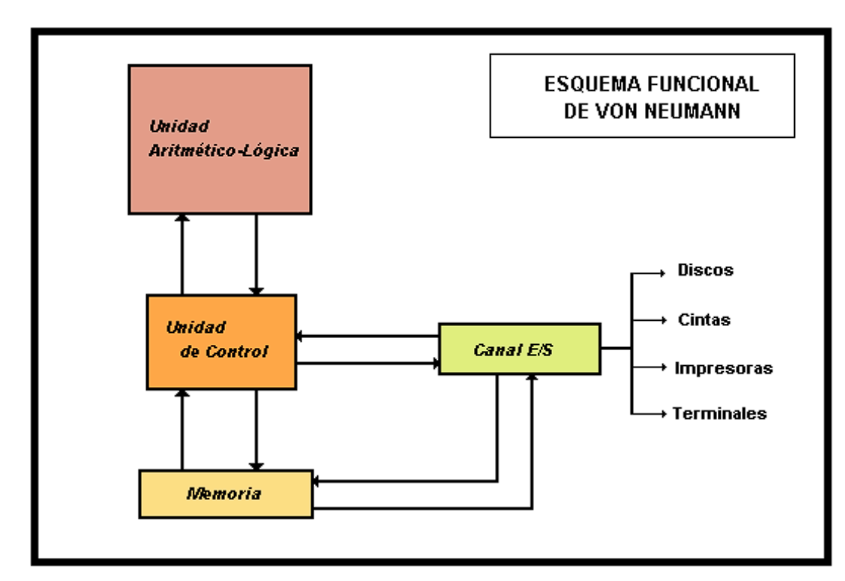

Resumidamente, una computadora es un conjunto ensamblado de unidades diferentes, y su funcionamiento viene dictado por el programa registrado en la memoria central. La UC gobierna la ejecución de las operaciones: es la que procesa lo dado por la memoria central, indica a la UAL qué operaciones realizar y recibe los datos del canal de entrada/salida.

## Conceptos preliminares

Antes de analizar la máquina Abacus, primero entendamos conceptos más básicos pero importantes para comprender cómo funciona una computadora.

### Registro

Los registros son lo más importante de un computador. Son una memoria muy rápida que permite almacenar una cierta cantidad de bits.

### Compuerta

Es la base del hardware sobre el cual se construyen las computadoras digitales. Son circuitos electrónicos biestables y unidireccionales. En términos simples, permiten el paso de la información en un solo sentido y solo tienen dos estados: abierto y cerrado, 1 y 0.

### Bus

Existen tres tipos de bus:

#### Bus de datos

Mueve la información entre los componentes del hardware internos y externos del sistema, tanto de entrada como de salida (mouse, teclado, etc.).

#### Bus de direcciones

Ubica los datos en la memoria, teniendo relación directa con los procesos del CPU.

#### Bus de control

Marca el estado de las instrucciones dadas a la PC.

Las transferencias de datos se pueden dar dentro de la computadora (buses internos entre la UC, UAL, etc.) y fuera de la computadora (buses externos para los canales de entrada/salida).

Con estos tres elementos podemos comprender mejor cómo se realizan las transferencias de información.

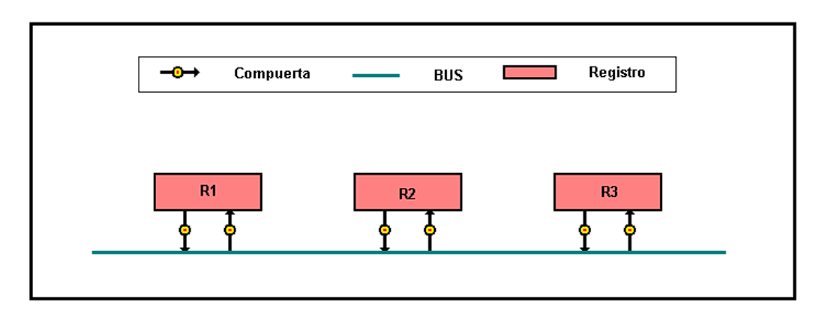

Para intercambiar información entre dos registros, esta debe pasar por un bus de datos entre sí. Sin embargo, primero debe haber una compuerta abierta que permita dicha transferencia, ya que los buses no pueden almacenar información. Una vez que la compuerta se cierra, se termina el paso de información entre registros.

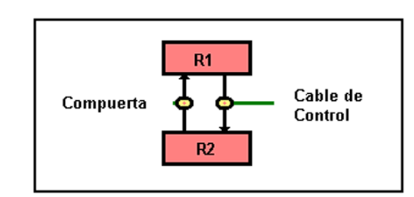

Si se debe transferir información de R1 a R2, primero se debe abrir la compuerta, lo que inicia la transferencia. Cuando el cable de control decide cerrar la compuerta, la información de R1 ya estará guardada en R2, finalizando la transferencia.

## Abacus: Máquina Elemental

Es una máquina de Von Neumann cuyo esquema es el siguiente:

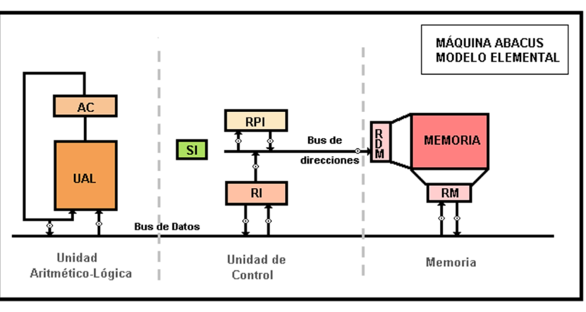

### Registros

- AC: acumulador
- SI: secuenciador de instrucciones
- RI: registro de instrucciones
- RM: registro de memoria
- RPI: registro de próxima instrucción
- RDM: registro de direcciones de memoria

### Descripción de componentes

#### UAL

Abacus es una máquina de una sola dirección. Su UAL tiene un elemento particular llamado acumulador, que almacena tanto el operando inicial como el resultado. Las instrucciones que recibe este UAL solo tienen una dirección, el segundo operando.

Las operaciones permitidas en este UAL son:

- Carga
- Almacenamiento
- Suma
- Operaciones lógicas

En esta máquina, todas las operaciones son contra el acumulador, y el resultado siempre se almacena en él.

#### UC

Se encarga de extraer y analizar las instrucciones de la memoria central. Para ello, cuenta con dos registros:

- **RPI:** Contiene la dirección de la próxima instrucción a ejecutar. Se comunica con la memoria y con el RI a través de un bus de direcciones. A medida que se ejecutan las instrucciones, este registro incrementa su contenido en una unidad, excepto en las instrucciones de ruptura de secuencia.
- **RI:** Contiene las instrucciones extraídas de la memoria. Podemos identificar dos partes fundamentales: el código de la operación y la dirección del operando. Este registro se comunica con la memoria mediante un bus.

El SI se encarga de, tras analizar el código, distribuir las órdenes a la UAL y a la memoria. También se encarga de abrir y cerrar las compuertas de la UC hacia los demás componentes, para la correcta transferencia de información.

#### Memoria

El intercambio de información entre la memoria y el resto del computador se realiza en dos registros:

- **RDM:** Contiene la dirección de la celda donde se escribirá la información.
- **RM:** Contiene el dato que debe ser leído o escrito en la memoria.

### Registro de instrucciones

Este Abacus soporta el siguiente formato de instrucciones:

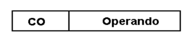

Como Abacus es una máquina unidireccional, podemos intuir cómo operaría una suma.

El orden de una suma sería, por ejemplo:

1. Cargar el primer operando en el AC (dentro de la UAL).
2. Sumar el segundo operando al contenido del AC.
3. Almacenar en memoria el resultado del contenido del AC.

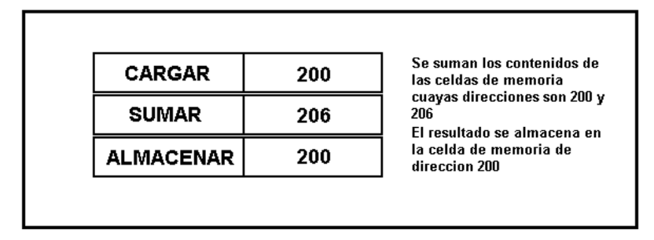

#### Relaciones

- Tamaño RPI = Tamaño RDM = Tamaño OP = Cantidad de celdas direccionables.
- Tamaño AC = Tamaño RI = Tamaño RM = Longitud de instrucciones = Longitud de celda.

### Desarrollo de instrucciones

Consta de dos fases:

- **Fase de búsqueda:** Consiste en localizar la instrucción a ejecutar. La secuencia que se lleva a cabo es igual en la búsqueda de operando. Se actualiza de forma secuencial la dirección de la siguiente instrucción a ejecutar.
  
- **Fase de ejecución:** Es el momento en que se ejecuta la instrucción en cuestión. Depende del tipo de tarea a realizar.

### Descripción de fases

#### Búsqueda de instrucción

La UC ordena la transferencia del contenido de RPI a RDM y envía la lectura de una instrucción a la memoria. El contenido de la celda queda almacenado en RM. Luego, la UC ordena la transferencia de RM a RI, analizando así la operación de la instrucción. Finalmente, se prepara el RPI para ejecutar la siguiente instrucción.

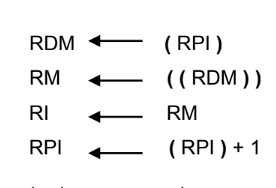

#### Ejecución de instrucción

La ejecución de cada instrucción implica el movimiento de datos. Como esto se realiza de forma secuencial y ordenada, la UC sigue las señales del reloj del sistema. Cada tarea es distinta, por lo que se analizarán los casos puntuales:

- **Suma:** Se debe sumar el contenido de RM al contenido del acumulador.

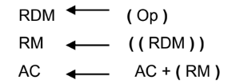

- **Carga:** Se debe almacenar en el acumulador un dato contenido en la memoria.

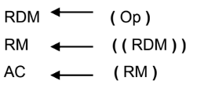

- **Almacenamiento:** Se debe guardar en la memoria el contenido del acumulador.

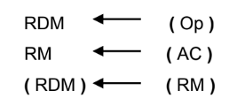

- **Bifurcación (salto condicional o incondicional)**

Cuando se ejecuta una instrucción de bifurcación, se modifica el contenido del registro RPI para que apunte a una nueva dirección de memoria, en lugar de continuar de manera secuencial. Existen dos tipos de bifurcación en Abacus:

- **Salto incondicional:** Se realiza siempre, sin importar ninguna condición. El RPI toma un nuevo valor que corresponde a la dirección de la instrucción a la que se desea saltar.

- **Salto condicional:** Se realiza solo si se cumple una determinada condición. Esta condición suele estar basada en el estado del acumulador (AC). Por ejemplo, si el valor del AC es cero, se realiza el salto. Si no, la ejecución continúa secuencialmente.

En ambos casos, el flujo de ejecución del programa puede ser alterado, lo que permite la creación de bucles y la toma de decisiones dentro del código.

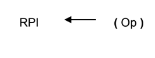

## Super Abacus

El Super Abacus es una máquina de tercera generación, con registros generalizados, lo que significa que estos registros pueden contener datos aritméticos, de direccionamiento, o ser utilizados para cálculos de direcciones.

Todos los cálculos se realizan en un solo sumador que, a su vez, actúa como la UAL y como el calculador de direcciones.

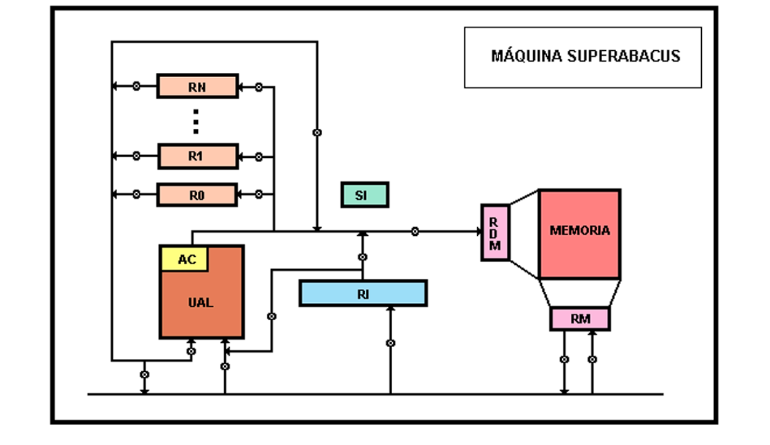

Se parece al Abacus, pero con una diferencia importante: el ciclo de memoria consta de 4 pulsos en lugar de 2, lo que permite realizar modificaciones en direcciones sin retrasar el ciclo de procesamiento.

### Otras características

1. Posee un conjunto de registros generales que pueden contener datos o direcciones.
2. No tiene RPI; esta función es asignada al registro R0, cuyo incremento se realiza con el sumador.
3. Es bidireccional.
4. La UAL puede tanto calcular direcciones como operar con datos.

### Registro de instrucciones

Este registro posee dos operandos: el operando 1 (R1) y el operando 2 (R2 - D), siendo "D" el offset (desplazamiento). R2 puede contener una dirección de una celda de memoria, sumando R2 + D.

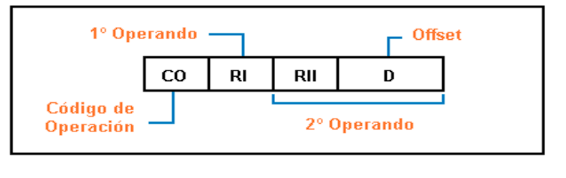

### Fase de búsqueda

Es igual a la del Abacus, pero en lugar de RPI, se usa el registro R0.

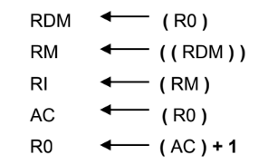

### Instrucciones

Las operaciones se pueden realizar entre registros, entre registros y un dato inmediato, o entre un registro y un operando en memoria.

1. **Sumar registros:** Se suma el contenido de ambos registros y se almacena en el primer operando.

   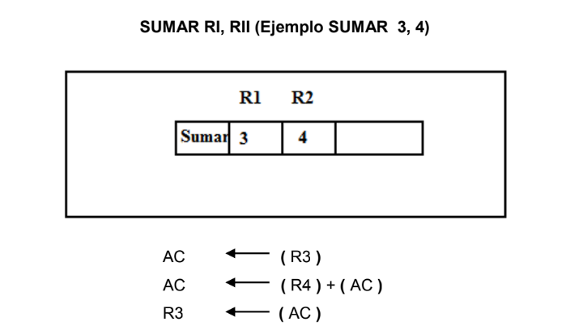

2. **Sumar inmediatos:** Se suma al registro indicado en el operando uno el dato inmediato almacenado en la instrucción. El resultado se almacena en el registro.

   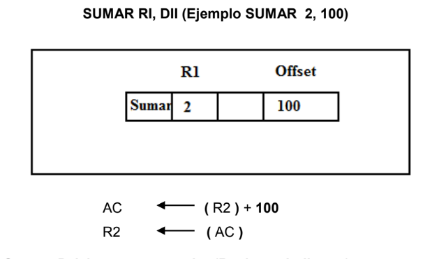

3. **Sumar palabra en memoria (registro indirecto):**

   Se suma al registro indicado en el primer operando el contenido de la celda de memoria cuya dirección está dada por el contenido del registro indicado en el segundo operando. El resultado se guarda en el primer operando.

   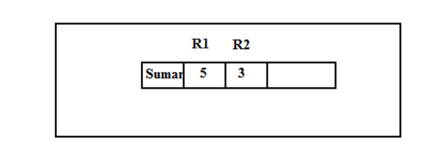
   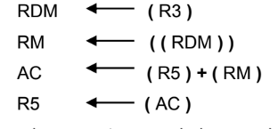

4. **Sumar palabra en memoria (desplazamiento):**

   Se suma el registro indicado en el primer operando con el contenido de la celda de memoria cuya dirección está dada por el contenido del registro indicado en el segundo operando más el offset. El resultado se almacena en el primer operando.

   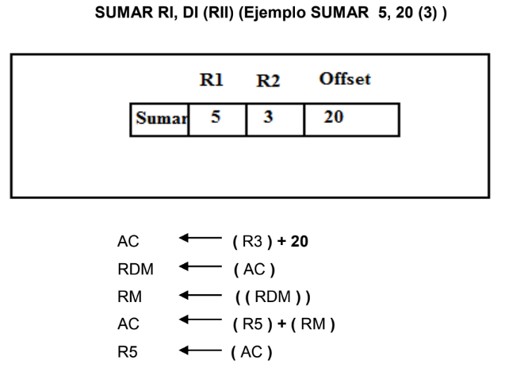

Cada instrucción tiene un código distinto para evitar confusiones.
